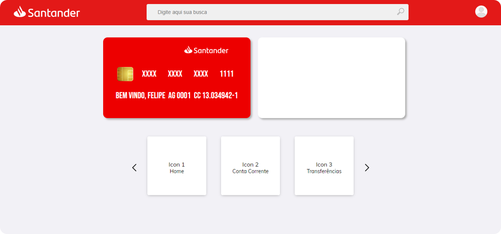

<div align="center">
  <a href="#">
      
  </a>

  <!-- project name -->
  <h1 align="center">Santander Home Clone - Angular</h1>
  
  <!-- project badges -->
  <p align="center">
 <!--
   
 -->
  <!--
    
  -->
    
    
    
    
  </p> 

  <!-- project description and menu -->
  <p align="center">
      A Clone From Santander Card home page
    <br />
    <a 
      href="## Usage">
      <strong>Go to usage now »</strong>
    </a>
    <br />
    <br />
    <a 
      href="https://github.com/felipeAguiarCode/
		angular-santander-home-clone/issues">
      Report Bug
    </a>
    ·
    <a 
      href="https://github.com/felipeAguiarCode/
			angular-santander-home-clone/issues/new">
      Request Feature
    </a>
  </p>
</div>

## Preview

<div align="center">
  <a href="#">
      
  </a>
</div>

## 🔥 Features
- [x] Generate a random Strong Password;

## Technologies

This project was developed with the following technologies:

-   [Angular](https://angular.io)


## Building

Run `ng serve` for a dev server. Navigate to `http://localhost:4200/`. The application will automatically reload if you change any of the source files.

## Usage

🔧 Run the script

```bash
$ npm run start
```

Runs the app in the development mode.<br/>

## Autor

| [<br><sub>Felipe Aguiar</sub>](https://github.com/felipeAguiarCode) |
| :---------------------------------------------------------------------------------------------------------------------------------------: |
|                                             [Linkedin](www.linkedin.com/in/felipe-aguiar-exe)                                             |
